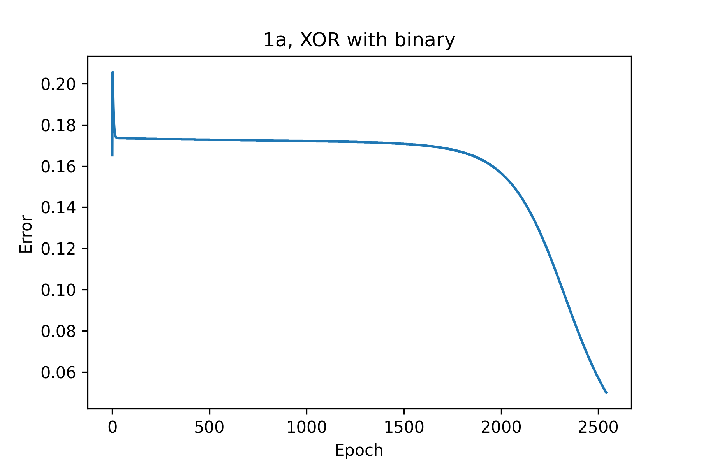
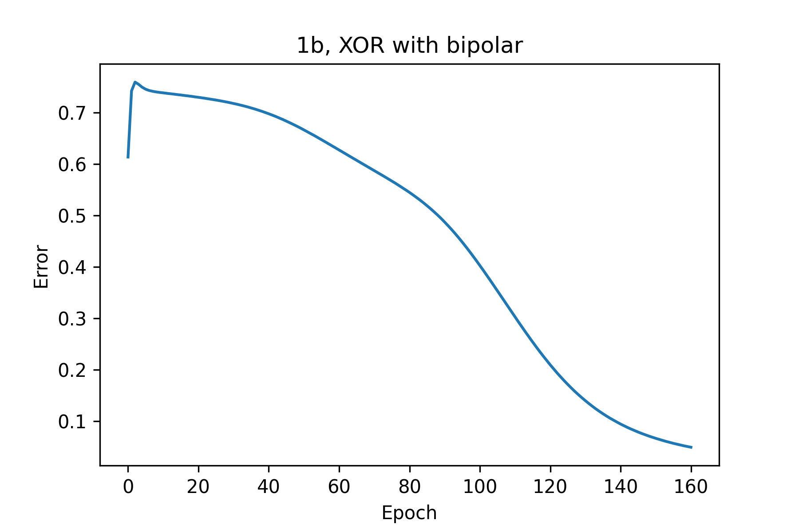
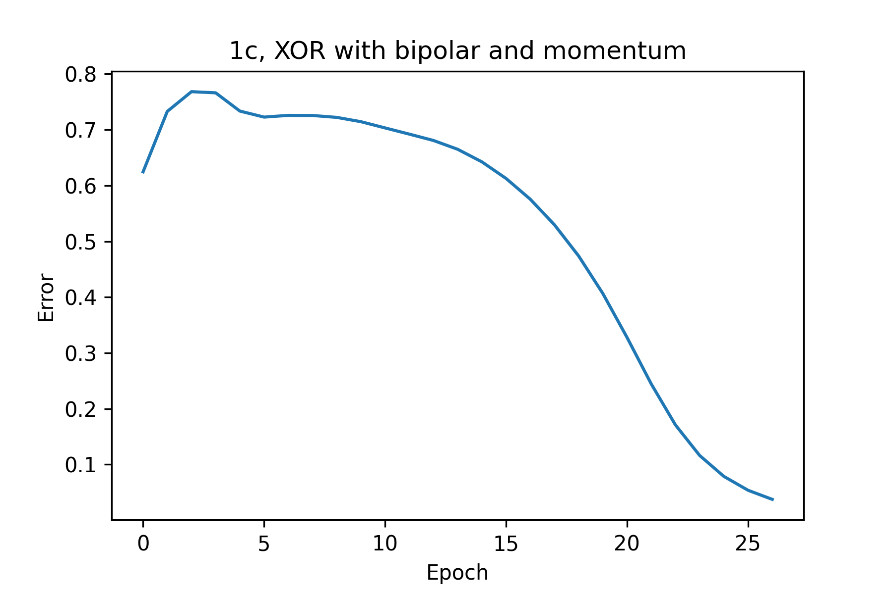

# CPEN502 Assignment 1

## Authors

Estella Qiu,

Tao Ma, 13432885

## 1.a



## 1.b



## 1.c



<div style="page-break-after: always;"></div>

## Appendix

### `org.homework.neuralnet.NeuralNetImpl`

```java
package org.homework.neuralnet;

import lombok.Getter;
import lombok.Setter;
import org.nd4j.linalg.api.buffer.DataType;
import org.nd4j.linalg.api.ndarray.INDArray;
import org.nd4j.linalg.factory.Nd4j;
import org.nd4j.linalg.ops.transforms.Transforms;
import org.slf4j.Logger;
import org.slf4j.LoggerFactory;

import java.io.BufferedReader;
import java.io.File;
import java.io.FileOutputStream;
import java.io.FileReader;
import java.io.IOException;
import java.io.PrintStream;
import java.io.Serializable;

@Getter
@Setter
public class NeuralNetImpl implements NeuralNetInterface, Serializable {
    private static final Logger logger = LoggerFactory.getLogger(NeuralNetImpl.class);
    private static final DataType NEURAL_NET_DATA_TYPE = DataType.DOUBLE;
    private static final int DEFAULT_ARG_NUM_INPUT_ROWS = 1;
    private static final int DEFAULT_PRINT_CYCLE = 100;
    private static final int DEFAULT_ARG_NUM_OUTPUTS_COLS = 1;
    private static final double DEFAULT_ERROR_THRESHOLD = 0.05;
    private static final double DEFAULT_RAND_RANGE_DIFFERENCE = .5;
    private int argNumInputs;
    private int argNumHidden;
    private double argLearningRate;
    private double argMomentumTerm;
    private double sigmoidLowerBound;
    private double sigmoidUpperBound;
    private INDArray input;
    private INDArray inputToHiddenWeight;
    private INDArray deltaInputToHiddenWeight;
    private INDArray hiddenLayerBias;
    private INDArray deltaHiddenLayerBias;
    private INDArray hiddenOutput;
    private INDArray hiddenToOutputWeight;
    private INDArray deltaHiddenToOutputWeight;
    private INDArray output;
    private INDArray outputLayerBias;
    private INDArray deltaOutputLayerBias;
    private boolean isBipolar;

    public NeuralNetImpl(
            final int argNumInputs,
            final int argNumHidden,
            final double argLearningRate,
            final double argMomentumTerm,
            final double sigmoidLowerBound,
            final double sigmoidUpperBound,
            final boolean isBipolar) {
        this.argNumInputs = argNumInputs;
        this.argNumHidden = argNumHidden;
        this.argLearningRate = argLearningRate;
        this.argMomentumTerm = argMomentumTerm;
        this.sigmoidLowerBound = sigmoidLowerBound;
        this.sigmoidUpperBound = sigmoidUpperBound;
        this.isBipolar = isBipolar;
        this.initialization();
    }

    @Override
    public double outputFor(final double[] X) {
        return this.forward(new double[][]{X}).toDoubleMatrix()[0][0];
    }

    /**
     * One pass of forward feeding calculation
     *
     * @param X input vector
     * @return output vector as INDArray
     */
    public INDArray forward(final double[][] X) {
        this.input = Nd4j.create(X);
        // Hidden output = [x1, x2] * [[h11, h12, h13, h14], [h21, h22, h23, h24]] + [b1, b2, b3, b4]
        this.hiddenOutput =
                this.sigmoidMatrix(this.input.mmul(this.inputToHiddenWeight).add(this.hiddenLayerBias));
        this.output =
                this.sigmoidMatrix(
                        this.hiddenOutput.mmul(this.hiddenToOutputWeight).add(this.outputLayerBias));
        return this.getOutput();
    }

    @Override
    public double train(final double[] X, final double argValue) {
        return this.train(X, new double[]{argValue});
    }

    /**
     * The value that should be mapped to the given input vector. I.e. the desired correct output
     * vector for an input.
     *
     * @param X The input vector
     * @param argValue The output vector to learn
     * @return The error in the output for that input vector
     */
    public double train(final double[] X, final double[] argValue) {
        final INDArray output = this.forward(new double[][]{X});
        final INDArray targetOutput = Nd4j.create(new double[][]{argValue});
        final INDArray lossValue = this.loss(output, targetOutput);
        final double error = lossValue.sum(0).sumNumber().doubleValue();
        this.backpropagation(output, targetOutput);
        return error;
    }

    /**
     * Train batch of input data
     *
     * @param X Input data. Each row represent an input vector, X.length is the number of input data,
     *     X[0].length is the length of one input vector
     * @param argValues Target value. argValues[i] is the target value of X[i]
     */
    public void train(final double[][] X, final double[][] argValues) {
        final int numSample = X.length;
        int elapsedEpoch = 0;
        double totalError = 0, curEpochError = 0;
        do {
            for (int i = 0; i < numSample; i++) {
                curEpochError += this.train(X[i], argValues[i]);
            }

            curEpochError /= numSample;
            totalError += curEpochError;

            if (elapsedEpoch++ % DEFAULT_PRINT_CYCLE == 0)
                logger.info(String.format("Current Error: %f at Epoch %d", curEpochError, elapsedEpoch));

        } while (elapsedEpoch > 0 && curEpochError > DEFAULT_ERROR_THRESHOLD);

        logger.info(
                String.format(
                        "NN trained for %d epochs, reached error per epoch = %.2f, best error: %.2f",
                        elapsedEpoch, totalError / elapsedEpoch, curEpochError));
    }

    /**
     * Perform a backward propagation update for the weight matrix according to <a
     * href="http://courses.ece.ubc.ca/592/PDFfiles/Backpropagation_c.pdf">CPEN502 material</a>
     *
     * @param actualOutput The actual output of the neural network
     * @param targetOutput The target output of the neural network
     */
    private void backpropagation(final INDArray actualOutput, final INDArray targetOutput) {
        final INDArray actualTargetDiff = actualOutput.sub(targetOutput);

        // Calculate weight update for hiddenToOutputWeight
        final INDArray deltaOutputLayer =
                this.isBipolar
                ? actualTargetDiff.mul((this.output.mul(-1).add(1)).mul((this.output.add(1))).mul(.5))
                : actualTargetDiff.mul(this.output.mul(this.output.mul(-1).add(1)));

        this.deltaHiddenToOutputWeight =
                this.deltaHiddenToOutputWeight
                        .mul(this.argMomentumTerm)
                        .add(this.hiddenOutput.transpose().mul(this.argLearningRate).mmul(deltaOutputLayer));

        // Calculate weight update for inputToHiddenWeight
        final INDArray deltaHiddenLayer =
                this.isBipolar
                ? (this.hiddenOutput.mul(-1).add(1))
                        .mul(this.hiddenOutput.add(1))
                        .mul(.5)
                        .mul(deltaOutputLayer.mmul(this.hiddenToOutputWeight.transpose()))
                : (this.hiddenOutput.mul(-1).add(1))
                        .mul(this.hiddenOutput)
                        .mul(deltaOutputLayer.mmul(this.hiddenToOutputWeight.transpose()));

        this.deltaInputToHiddenWeight =
                this.deltaInputToHiddenWeight
                        .mul(this.argMomentumTerm)
                        .add(this.input.transpose().mul(this.argLearningRate).mmul(deltaHiddenLayer));

        // Perform the update
        this.hiddenToOutputWeight = this.hiddenToOutputWeight.sub(this.deltaHiddenToOutputWeight);
        this.inputToHiddenWeight = this.inputToHiddenWeight.sub(this.deltaInputToHiddenWeight);

        // Calculate bias update
        this.deltaHiddenLayerBias =
                this.deltaHiddenLayerBias
                        .mul(this.argMomentumTerm)
                        .add(deltaHiddenLayer.mul(this.argLearningRate));

        this.deltaOutputLayerBias =
                this.deltaOutputLayerBias
                        .mul(this.argMomentumTerm)
                        .add(deltaOutputLayer.mul(this.argLearningRate));

        this.hiddenLayerBias = this.hiddenLayerBias.sub(this.deltaHiddenLayerBias);
        this.outputLayerBias = this.outputLayerBias.sub(this.deltaOutputLayerBias);
    }

    /**
     * Loss function: 1/2 * (y - y')^2
     *
     * @param actualOutput Actual output that the model produce
     * @param targetOutput Target output that the model need
     * @return Array of loss
     */
    public INDArray loss(final INDArray actualOutput, final INDArray targetOutput) {
        return Transforms.pow(actualOutput.sub(targetOutput), 2).mul(.5);
    }

    /**
     * Calculate sigmoid for every entry of the matrix
     *
     * @param indArray Matrix needed to be sigmoided
     * @return Matrix after applying sigmoid
     */
    public INDArray sigmoidMatrix(final INDArray indArray) {
        if (!this.isBipolar) return Transforms.sigmoid(indArray);

        for (int row = 0; row < indArray.shape()[0]; row++) {
            for (int col = 0; col < indArray.shape()[1]; col++) {
                indArray.putScalar(new int[]{row, col}, this.sigmoid(indArray.getDouble(row, col)));
            }
        }

        return indArray;
    }

    @Override
    public double sigmoid(final double x) {
        return (2 / (1 + Math.pow(Math.E, (-1 * x)))) - 1;
    }

    @Override
    public double customSigmoid(final double x) {
        return (this.sigmoidUpperBound - this.sigmoidLowerBound) / (1 + Math.pow(Math.E, (-1 * x)))
                - this.sigmoidLowerBound;
    }

    private void initialization() {
        this.initializeWeights();
        this.initializeBias();
        this.initializeLayer();
    }

    @Override
    public void initializeWeights() {
        this.inputToHiddenWeight =
                Nd4j.rand(NEURAL_NET_DATA_TYPE, this.argNumInputs, this.argNumHidden)
                        .sub(DEFAULT_RAND_RANGE_DIFFERENCE);
        this.hiddenToOutputWeight =
                Nd4j.rand(NEURAL_NET_DATA_TYPE, this.argNumHidden, DEFAULT_ARG_NUM_OUTPUTS_COLS)
                        .sub(DEFAULT_RAND_RANGE_DIFFERENCE);
    }

    @Override
    public void zeroWeights() {
        this.inputToHiddenWeight =
                Nd4j.zeros(NEURAL_NET_DATA_TYPE, this.argNumInputs, this.argNumHidden);
        this.hiddenToOutputWeight =
                Nd4j.zeros(NEURAL_NET_DATA_TYPE, this.argNumHidden, DEFAULT_ARG_NUM_OUTPUTS_COLS);
    }

    /** Initialize bias value to 1.0 */
    private void initializeBias() {
        this.hiddenLayerBias =
                Nd4j.ones(NEURAL_NET_DATA_TYPE, DEFAULT_ARG_NUM_INPUT_ROWS, this.argNumHidden);
        this.outputLayerBias =
                Nd4j.ones(NEURAL_NET_DATA_TYPE, DEFAULT_ARG_NUM_INPUT_ROWS, DEFAULT_ARG_NUM_OUTPUTS_COLS);
    }

    /** Initialize layer placeholder */
    private void initializeLayer() {
        this.input = Nd4j.rand(NEURAL_NET_DATA_TYPE, DEFAULT_ARG_NUM_INPUT_ROWS, this.argNumInputs);
        this.hiddenOutput =
                Nd4j.rand(NEURAL_NET_DATA_TYPE, DEFAULT_ARG_NUM_INPUT_ROWS, this.argNumHidden);
        this.output =
                Nd4j.rand(NEURAL_NET_DATA_TYPE, DEFAULT_ARG_NUM_INPUT_ROWS, DEFAULT_ARG_NUM_OUTPUTS_COLS);

        this.deltaHiddenLayerBias =
                Nd4j.zeros(NEURAL_NET_DATA_TYPE, DEFAULT_ARG_NUM_INPUT_ROWS, this.argNumHidden);
        this.deltaOutputLayerBias =
                Nd4j.zeros(NEURAL_NET_DATA_TYPE, DEFAULT_ARG_NUM_INPUT_ROWS, DEFAULT_ARG_NUM_OUTPUTS_COLS);

        this.deltaInputToHiddenWeight =
                Nd4j.zeros(NEURAL_NET_DATA_TYPE, this.argNumInputs, this.argNumHidden);
        this.deltaHiddenToOutputWeight =
                Nd4j.zeros(NEURAL_NET_DATA_TYPE, this.argNumHidden, DEFAULT_ARG_NUM_OUTPUTS_COLS);
    }

    @Override
    public void save(final File argFile) {
        try {
            final FileOutputStream fileOutputStream = new FileOutputStream(argFile, false);
            final PrintStream printStream = new PrintStream(fileOutputStream);

            final long inputToHiddenWeightRows = this.inputToHiddenWeight.size(0);
            final long inputToHiddenWeightCols = this.inputToHiddenWeight.size(1);
            final long hiddenToOutputWeightRows = this.hiddenToOutputWeight.size(0);
            final long hiddenToOutputWeightCols = this.hiddenToOutputWeight.size(1);
            printStream.println(inputToHiddenWeightRows);
            printStream.println(inputToHiddenWeightCols);
            printStream.println(hiddenToOutputWeightRows);
            printStream.println(hiddenToOutputWeightCols);

            for (int x = 0; x < inputToHiddenWeightRows; ++x) {
                for (int y = 0; y < inputToHiddenWeightCols; ++y) {
                    printStream.println(this.inputToHiddenWeight.getDouble(x, y));
                }
            }
            for (int x = 0; x < hiddenToOutputWeightRows; ++x) {
                for (int y = 0; y < hiddenToOutputWeightCols; ++y) {
                    printStream.println(this.hiddenToOutputWeight.getDouble(x, y));
                }
            }

            printStream.flush();
            printStream.close();
        } catch (final IOException error) {
            System.out.println("Failed to save the weights of a neural net.");
        }
    }

    @Override
    public void load(final String argFileName) throws IOException {
        try {
            final BufferedReader bufferedReader = new BufferedReader(new FileReader(argFileName));
            final long inputToHiddenWeightRows = Long.parseLong(bufferedReader.readLine());
            final long inputToHiddenWeightCols = Long.parseLong(bufferedReader.readLine());
            final long hiddenToOutputWeightRows = Long.parseLong(bufferedReader.readLine());
            final long hiddenToOutputWeightCols = Long.parseLong(bufferedReader.readLine());
            if ((inputToHiddenWeightRows != this.inputToHiddenWeight.size(0))
                    || (inputToHiddenWeightCols != this.inputToHiddenWeight.size(1))) {
                logger.info("wrong number of input neurons");
                bufferedReader.close();
                throw new IOException();
            }
            if ((hiddenToOutputWeightRows != this.hiddenToOutputWeight.size(0))
                    || (hiddenToOutputWeightCols != this.hiddenToOutputWeight.size(1))) {
                logger.info("wrong number of hidden neurons");
                bufferedReader.close();
                throw new IOException();
            }

            for (int x = 0; x < inputToHiddenWeightRows; ++x) {
                for (int y = 0; y < inputToHiddenWeightCols; ++y) {
                    this.inputToHiddenWeight.put(x, y, Double.valueOf(bufferedReader.readLine()));
                }
            }
            for (int x = 0; x < hiddenToOutputWeightRows; ++x) {
                for (int y = 0; y < hiddenToOutputWeightCols; ++y) {
                    this.hiddenToOutputWeight.put(x, y, Double.valueOf(bufferedReader.readLine()));
                }
            }

            bufferedReader.close();
        } catch (final IOException error) {
            System.out.println("Failed to open reader: " + error);
        }
    }
}
```

### `org.homework.neuralnet.NeuralNetImplTest`

```java
package org.homework.neuralnet;

import org.junit.jupiter.api.BeforeEach;
import org.junit.jupiter.api.Test;
import org.nd4j.linalg.api.ndarray.INDArray;
import org.nd4j.linalg.factory.Nd4j;

import java.io.File;
import java.io.IOException;
import java.util.Arrays;
import java.util.stream.Stream;

import static org.junit.jupiter.api.Assertions.assertArrayEquals;
import static org.junit.jupiter.api.Assertions.assertEquals;

class NeuralNetImplTest {

    NeuralNetImpl neuralNet;

    @BeforeEach
    void setUp() {
        this.neuralNet = new NeuralNetImpl(2, 4, .2, .0, 1, 0, false);
    }

    @Test
    void TEST_TRAIN_XOR_RANDOM() {
        final double[][] x = this.getRandomInputVector(10, 2);
        final double[][] yHat = this.getRandomInputVector(10, 1);
        this.neuralNet.train(x, yHat);
        this.printNNTrainState(x, yHat, this.neuralNet.forward(x).toDoubleMatrix());
    }

    @Test
    void TEST_TRAIN_XOR_THEN_APPLY() {
        final double[][] x = new double[][]{{0, 0}, {0, 1}, {1, 0}, {1, 1}};
        final double[][] yHat = new double[][]{{0}, {1}, {1}, {0}};
        this.neuralNet.train(x, yHat);
        this.printNNTrainState(x, yHat, this.neuralNet.forward(x).toDoubleMatrix());
    }

    @Test
    void TEST_TRAIN_XOR_BIPOLAR() {
        this.neuralNet.setBipolar(true);
        final double[][] x = new double[][]{{-1, -1}, {-1, 1}, {1, -1}, {1, 1}};
        final double[][] yHat = new double[][]{{-1}, {1}, {1}, {-1}};
        this.neuralNet.train(x, yHat);
        this.printNNTrainState(x, yHat, this.neuralNet.forward(x).toDoubleMatrix());
    }

    @Test
    void FORWARD_SHOULD_MAINTAIN_SHAPE() {
        final INDArray outputIndArray = this.neuralNet.forward(this.getRandomInputVector(1, 2));
        assertArrayEquals(new long[]{1, 1}, outputIndArray.shape());
    }

    @Test
    void LOSS_FUNCTION_CAL_AS_EXPECTED() {
        final double[][] randomOutputVector = this.getRandomInputVector(1, 1);
        final double[][] targetArray = this.getRandomInputVector(1, 1);
        final double[][] manualLoss = new double[1][1];
        manualLoss[0][0] = Math.pow(randomOutputVector[0][0] - targetArray[0][0], 2) / 2;
        assertArrayEquals(
                manualLoss,
                this.neuralNet
                        .loss(Nd4j.create(randomOutputVector), Nd4j.create(targetArray))
                        .toDoubleMatrix());
    }

    @Test
    void SAVE_AND_LOAD_WEIGHTS() throws IOException {
        final INDArray inputToHiddenWeight = this.neuralNet.getInputToHiddenWeight();
        final INDArray hiddenToOutputWeight = this.neuralNet.getHiddenToOutputWeight();

        final String filename = "./weights";
        final File file = new File(filename);
        this.neuralNet.save(file);
        this.neuralNet.load(filename);

        assertEquals(inputToHiddenWeight, this.neuralNet.getInputToHiddenWeight());
        assertEquals(hiddenToOutputWeight, this.neuralNet.getHiddenToOutputWeight());
    }

    /**
     * get random input vector
     *
     * @param nRows num rows for input vector
     * @param nCols num cols for input vector
     * @return input vector
     */
    private double[][] getRandomInputVector(final int nRows, final int nCols) {
        return Nd4j.rand(nRows, nCols).toDoubleMatrix();
    }

    private void printNNTrainState(
            final double[][] X, final double[][] target, final double[][] actual) {
        System.out.printf(
                "Input: \n %s \n Target y: \n %s \n Actual y: \n %s \n",
                Stream.of(X, target, actual).map(Arrays::deepToString).toArray());
    }
}
```

