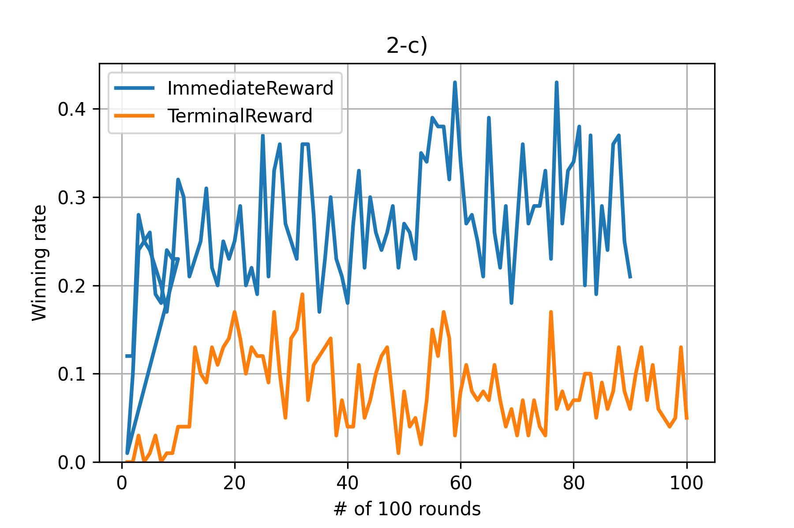

# CPEN502 Assignment 2

## Authors

Xuechun Qiu, 55766737

Tao Ma, 13432885

## Part 1

As for part 1, your submission should be a brief document clearly showing the graphs requested about. Please number your
graphs as above and also include in your report an appendix section containing your source code.

## Part 2

a) Draw a graph of a parameter that reflects a measure of progress of learning and comment on the convergence of
learning of your robot.

**Total rounds: 30,000, Off policy, Immediate reward, e = 0.1**


b) Using your robot, show a graph comparing the performance of your robot using on-policy learning vs off-policy
learning.

**Total rounds: 10,000, Immediate reward, e = 0.1**


c) Implement a version of your robot that assumes only terminal rewards and show & compare its behaviour with one having
intermediate rewards.

**Total rounds: 10,000, Off Policy, e = 0.1**



## Part 3

This part is about exploration. While training via RL, the next move is selected randomly with probability and greedily
with probability

a) Compare training performance using different values of e including no exploration at all. Provide graphs of the
measured performance of your tank.

**Total rounds: 30,000, Off policy, Immediate reward**


<div style="page-break-after: always;"></div>

## Appendix

### org.homework.robot.model.Action

```java
package org.homework.robot.model;

public enum Action {
    AHEAD_LEFT(new double[] {50.0, 0.0, 50.0, 0.0}),
    AHEAD_RIGHT(new double[] {0.0, 50.0, 50.0, 0.0}),
    BACK_LEFT(new double[] {50.0, 0.0, -50.0, 0.0}),
    BACK_RIGHT(new double[] {0.0, 50.0, -50.0, 0.0}),
    AHEAD(new double[] {0.0, 0.0, 50.0, 0.0}),
    BACK(new double[] {0.0, 0.0, -50.0, 0.0}),
    HEAVY_FIRE(new double[] {0.0, 0.0, 0.0, 3.0}),
    LIGHT_FIRE(new double[] {0.0, 0.0, 0.0, 1.0});

    final double[] direction;

    Action(final double[] direction) {
        this.direction = direction;
    }

    public double[] getDirection() {
        return this.direction;
    }
}
```

### org.homework.robot.model.State

```java
package org.homework.robot.model;

import com.google.common.collect.ImmutableMap;
import org.immutables.value.Value;

import java.util.Arrays;

import static org.homework.robot.model.StateName.StateType.DISTANCE_TO_ENEMY;
import static org.homework.robot.model.StateName.StateType.DISTANCE_TO_WALL;
import static org.homework.robot.model.StateName.StateType.ENEMY_HP;
import static org.homework.robot.model.StateName.StateType.ENEMY_ROBOT_HEADING;
import static org.homework.robot.model.StateName.StateType.MY_HP;

@Value.Immutable
public abstract class State {
    @Value.Default
    public StateName.HP getCurrentHP() {
        return StateName.HP.MID;
    }

    @Value.Default
    public StateName.ENEMY_HP getCurrentEnemyHP() {
        return StateName.ENEMY_HP.MID;
    }

    @Value.Default
    public StateName.DISTANCE_TO_ENEMY getCurrentDistanceToEnemy() {
        return StateName.DISTANCE_TO_ENEMY.MID;
    }

    @Value.Default
    public StateName.DISTANCE_TO_WALL getCurrentDistanceToWall() {
        return StateName.DISTANCE_TO_WALL.MID;
    }

    @Value.Default
    public StateName.ENEMY_ROBOT_HEADING getCurrentEnemyRobotHeading() {
        return StateName.ENEMY_ROBOT_HEADING.MID;
    }

    @Value.Default
    public StateName.X getX() {
        return StateName.X.MID;
    }

    @Value.Default
    public StateName.Y getY() {
        return StateName.Y.MID;
    }

    @Value.Default
    public int[] getIndexedStateValue() {
        return new int[] {
            this.getCurrentHP().ordinal(),
            this.getCurrentEnemyHP().ordinal(),
            this.getCurrentDistanceToEnemy().ordinal(),
            this.getCurrentDistanceToWall().ordinal(),
            this.getCurrentEnemyRobotHeading().ordinal(),
            this.getX().ordinal(),
            this.getY().ordinal()
        };
    }

    @Value.Default
    public ImmutableMap<StateName.StateType, Integer> getStateToDimensionMap() {
        return ImmutableMap.<StateName.StateType, Integer>builder()
                .put(MY_HP, MY_HP.getNumTypes())
                .put(ENEMY_HP, ENEMY_HP.getNumTypes())
                .put(DISTANCE_TO_ENEMY, DISTANCE_TO_ENEMY.getNumTypes())
                .put(DISTANCE_TO_WALL, DISTANCE_TO_WALL.getNumTypes())
                .put(ENEMY_ROBOT_HEADING, ENEMY_ROBOT_HEADING.getNumTypes())
                .build();
    }

    @Override
    public String toString() {
        return String.format(
                "Current State Array: %s", Arrays.toString(this.getIndexedStateValue()));
    }

    @Override
    public boolean equals(final Object obj) {
        if (obj == this) return true;

        if (!(obj instanceof State)) return false;

        final State state = (State) obj;

        return Arrays.equals(this.getIndexedStateValue(), state.getIndexedStateValue());
    }

    @Override
    public int hashCode() {
        return Arrays.hashCode(this.getIndexedStateValue());
    }
}
```

### org.homework.robot.model.StateName

```java
package org.homework.robot.model;

public class StateName {
    public enum StateType {
        MY_HP(3),
        ENEMY_HP(3),
        DISTANCE_TO_ENEMY(3),
        DISTANCE_TO_WALL(3),
        ENEMY_ROBOT_HEADING(3);

        final int numTypes;

        StateType(final int _numTypes) {
            this.numTypes = _numTypes;
        }

        public int getNumTypes() {
            return this.numTypes;
        }
    }

    public enum HP {
        LOW,
        MID,
        HIGH
    }

    public enum ENEMY_HP {
        LOW,
        MID,
        HIGH
    }

    public enum DISTANCE_TO_ENEMY {
        LOW,
        MID,
        HIGH
    }

    public enum DISTANCE_TO_WALL {
        LOW,
        MID,
        HIGH
    }

    public enum ENEMY_ROBOT_HEADING {
        LOW,
        MID_LOW,
        MID,
        MID_HIGH,
        HIGH
    }

    public enum X {
        LOW,
        MID_LOW,
        MID,
        MID_HIGH,
        HIGH
    }

    public enum Y {
        LOW,
        MID_LOW,
        MID,
        MID_HIGH,
        HIGH
    }
}
```

### org.homework.rl.LUTImpl

```java
package org.homework.rl;

import lombok.Getter;
import org.homework.robot.model.Action;
import org.homework.robot.model.ImmutableState;
import org.homework.robot.model.State;
import org.homework.robot.model.StateName;
import robocode.RobocodeFileOutputStream;

import java.io.BufferedReader;
import java.io.File;
import java.io.FileInputStream;
import java.io.IOException;
import java.io.InputStreamReader;
import java.io.PrintStream;
import java.util.HashMap;
import java.util.Map;
import java.util.Optional;
import java.util.Random;

import static org.homework.robot.model.StateName.StateType.DISTANCE_TO_ENEMY;
import static org.homework.robot.model.StateName.StateType.DISTANCE_TO_WALL;
import static org.homework.robot.model.StateName.StateType.ENEMY_HP;
import static org.homework.robot.model.StateName.StateType.MY_HP;

@Getter
public class LUTImpl implements LUTInterface {
    private static final double learningRate = 0.1;
    private static final double discountFactor = 0.9;
    private static final double epsilon = 1 - 0.7;
    private final int myHPTypes;
    private final int enemyHPTypes;
    private final int distanceToEnemyTypes;
    private final int distanceToWallTypes;
    private final int actionSize;
    public Map<State, double[]> qTable;

    public LUTImpl(
            final int myHPTypes,
            final int enemyHPTypes,
            final int distanceToEnemyTypes,
            final int distanceToWallTypes,
            final int actionSize) {
        this.myHPTypes = myHPTypes;
        this.enemyHPTypes = enemyHPTypes;
        this.distanceToEnemyTypes = distanceToEnemyTypes;
        this.distanceToWallTypes = distanceToWallTypes;
        this.actionSize = actionSize;

        this.initialiseLUT();
    }

    public LUTImpl(final State state) {
        this.myHPTypes = this.getStateDimension(state, MY_HP);
        this.enemyHPTypes = this.getStateDimension(state, ENEMY_HP);
        this.distanceToEnemyTypes = this.getStateDimension(state, DISTANCE_TO_ENEMY);
        this.distanceToWallTypes = this.getStateDimension(state, DISTANCE_TO_WALL);
        this.actionSize = Action.values().length;
        this.initialiseLUT();
    }

    @Override
    public void initialiseLUT() {
        this.qTable = new HashMap<>();
    }

    @Override
    public int indexFor(final double[] X) {
        return 0;
    }

    /**
     * most time we will find the greedy action, but also do some exploration
     *
     * @param state a State object represent the current state
     * @return the index of the chosen action
     */
    public int chooseAction(final State state) {
        if (Math.random() < epsilon) {
            // explore
            return this.chooseRandomAction();
        }
        return this.chooseGreedyAction(state);
    }

    /**
     * given state, get the max action value from q table
     *
     * @param state a State object represent the current state Q(s,a') from Q(s)
     * @return the index of the best action
     */
    int chooseGreedyAction(final State state) {
        double curMax = -Double.MAX_VALUE;
        int curAction = -1;

        final double[] currentActionValue =
                this.qTable.getOrDefault(state, new double[this.actionSize]);

        this.qTable.put(state, currentActionValue);

        for (int action = 0; action < currentActionValue.length; action++) {
            if (currentActionValue[action] > curMax) {
                curMax = currentActionValue[action];
                curAction = action;
            }
        }

        return curAction;
    }

    int chooseRandomAction() {
        return new Random().nextInt(this.actionSize);
    }

    void setQValue(final double qValue, final State state, final int action) {
        final double[] value = this.qTable.getOrDefault(state, new double[this.actionSize]);
        value[action] = qValue;
        this.qTable.put(state, value);
    }

    double getQValue(final State state, final int action) {
        final double[] currentActionValue =
                this.qTable.getOrDefault(state, new double[this.actionSize]);
        this.qTable.put(state, currentActionValue);
        return currentActionValue[action];
    }

    /**
     * @param prevDimension an array contains previous states and action info to get previous Q
     *     value Q(s',a')
     * @param curDimension an array contains current states and action info to get current Q value
     *     Q(s,a)
     * @param reward an integer represents reward
     * @param isOnPolicy if true, then use Sarsa. Otherwise, use Q learning
     */
    public void computeQValue(
            final State prevDimension,
            final State curDimension,
            final int prevAction,
            final double reward,
            final boolean isOnPolicy) {

        final double prevQValue = this.getQValue(prevDimension, prevAction);
        final double curQValue = this.getQValue(curDimension, prevAction);

        if (isOnPolicy) {
            // Sarsa
            this.setQValue(
                    prevQValue + learningRate * (reward + discountFactor * curQValue - prevQValue),
                    prevDimension,
                    prevAction);
        } else {
            // Q learning
            final int curAction = this.chooseGreedyAction(curDimension);
            final double maxQValue = this.getQValue(curDimension, curAction);
            this.setQValue(
                    prevQValue + learningRate * (reward + discountFactor * maxQValue - prevQValue),
                    prevDimension,
                    prevAction);
        }
    }

    public int getStateDimension(final State state, final StateName.StateType stateType) {
        return Optional.ofNullable(state.getStateToDimensionMap().get(stateType)).orElse(0);
    }

    @Override
    public double outputFor(final double[] X) {
        return 0;
    }

    @Override
    public double train(final double[] X, final double argValue) {
        return 0;
    }

    @Override
    public void save(final File argFile) {
        PrintStream saveFile = null;
        try {
            saveFile = new PrintStream(new RobocodeFileOutputStream(argFile));
        } catch (final IOException e) {
            System.out.println("Could not create output stream for LUT save file.");
        }

        assert saveFile != null;
        int numEntriesSaved = 0;
        saveFile.println(this.qTable.size());
        for (final Map.Entry<State, double[]> entry : this.qTable.entrySet()) {
            final int[] states = entry.getKey().getIndexedStateValue();
            final double[] actionValues = entry.getValue();
            saveFile.println(states.length);
            for (final int state : states) {
                saveFile.println(state);
            }
            for (int i = 0; i < this.actionSize; ++i) {
                saveFile.println(actionValues[i]);
            }
            numEntriesSaved++;
        }
        saveFile.close();
        System.out.println("Number of LUT table entries saved is " + numEntriesSaved);
    }

    @Override
    public void load(final String argFileName) throws IOException {}

    public void load(final File argFileName) throws IOException {
        if (!argFileName.exists() || argFileName.length() == 0) return;
        final FileInputStream inputFile = new FileInputStream(argFileName);
        final BufferedReader inputReader = new BufferedReader(new InputStreamReader(inputFile));

        int maxIndexFromFile = Integer.parseInt(inputReader.readLine());

        while (maxIndexFromFile-- > 0) {
            final int stateSize = Integer.parseInt(inputReader.readLine());
            final int[] stateValues = new int[stateSize];
            for (int i = 0; i < stateSize; ++i) {
                stateValues[i] = Integer.parseInt(inputReader.readLine());
            }
            final State state = this.getStateFromStateValues(stateValues);
            final double[] actionValues = new double[this.actionSize];
            for (int i = 0; i < this.actionSize; ++i) {
                actionValues[i] = Double.parseDouble(inputReader.readLine());
            }
            this.qTable.put(state, actionValues);
        }
        inputReader.close();
    }

    public State getStateFromStateValues(final int[] indexedStateValue) {
        return ImmutableState.builder()
                .currentHP(StateName.HP.values()[indexedStateValue[0]])
                .currentEnemyHP(StateName.ENEMY_HP.values()[indexedStateValue[1]])
                .currentDistanceToEnemy(StateName.DISTANCE_TO_ENEMY.values()[indexedStateValue[2]])
                .currentDistanceToWall(StateName.DISTANCE_TO_WALL.values()[indexedStateValue[3]])
                .currentEnemyRobotHeading(
                        StateName.ENEMY_ROBOT_HEADING.values()[indexedStateValue[4]])
                .x(StateName.X.values()[indexedStateValue[5]])
                .y(StateName.Y.values()[indexedStateValue[6]])
                .build();
    }
}
```

### org.homework.robot.AIRobot

```java
package org.homework.robot;

import lombok.Setter;
import org.homework.rl.LUTImpl;
import org.homework.robot.model.Action;
import org.homework.robot.model.ImmutableState;
import org.homework.robot.model.State;
import org.homework.robot.model.StateName;
import org.homework.util.LogFileUtil;
import robocode.AdvancedRobot;
import robocode.BattleEndedEvent;
import robocode.BulletHitEvent;
import robocode.BulletMissedEvent;
import robocode.DeathEvent;
import robocode.HitByBulletEvent;
import robocode.HitRobotEvent;
import robocode.HitWallEvent;
import robocode.RobocodeFileOutputStream;
import robocode.RoundEndedEvent;
import robocode.ScannedRobotEvent;
import robocode.WinEvent;

import java.io.File;
import java.io.IOException;
import java.nio.charset.StandardCharsets;
import java.util.Arrays;
import java.util.Collections;
import java.util.Date;

@Setter
public class AIRobot extends AdvancedRobot {
    private static final double BASIC_REWARD = .5;
    public static LogFile log = new LogFile();
    private static int winRound = 0;
    private static int totalRound = 0;
    private static int rounds = 0;
    private static State currentState = ImmutableState.builder().build();
    private static LUTImpl lut = new LUTImpl(currentState);
    private static State prevState = ImmutableState.builder().from(currentState).build();
    private final boolean isOnPolicy = false;
    private boolean isImmediateReward = true;
    private double reward = .0;
    private Action currentAction;
    private double bearing = 0.0;
    private RobocodeFileOutputStream robocodeFileOutputStream;

    @Override
    public void run() {
        this.setAdjustGunForRobotTurn(true);
        this.setAdjustRadarForGunTurn(true);
        while (true) {
            this.setTurnRadarLeftRadians(2 * Math.PI);
            this.scan();
            this.currentAction = this.chooseCurrentAction();
            this.act();
            this.updateQValue();
            this.reward = .0;
        }
    }

    /** Act based on action */
    private void act() {
        this.setTurnLeft(this.currentAction.getDirection()[0]);
        this.setTurnRight(this.currentAction.getDirection()[1]);
        this.setAhead(this.currentAction.getDirection()[2]);
        if (this.currentAction.name().contains("FIRE")) {
            this.setTurnGunRight(this.getHeading() - this.getGunHeading() + this.bearing);
            this.setFire(this.currentAction.getDirection()[3]);
        }
        this.execute();
    }

    /**
     * Get current scanned state
     *
     * @param event The event of scan
     * @return State represent current
     */
    public State getCurrentState(final ScannedRobotEvent event) {
        this.bearing = event.getBearing();
        return ImmutableState.builder()
                .currentHP(StateName.HP.values()[this.toCategoricalState(this.getEnergy(), 30, 2)])
                .currentDistanceToWall(
                        StateName.DISTANCE_TO_WALL
                                .values()[
                                this.toCategoricalState(
                                        this.getDistanceFromWall(this.getX(), this.getY()), 30, 2)])
                .x(StateName.X.values()[this.toCategoricalState(this.getX(), 160, 4)])
                .y(StateName.Y.values()[this.toCategoricalState(this.getY(), 120, 4)])
                .currentEnemyHP(
                        StateName.ENEMY_HP
                                .values()[this.toCategoricalState(event.getBearing(), 30, 2)])
                .currentDistanceToEnemy(
                        StateName.DISTANCE_TO_ENEMY
                                .values()[this.toCategoricalState(event.getDistance(), 30, 2)])
                .currentEnemyRobotHeading(
                        StateName.ENEMY_ROBOT_HEADING
                                .values()[this.toCategoricalState(event.getHeading(), 72, 4)])
                .build();
    }

    /**
     * Calculate distance from wall
     *
     * @param x1 x1
     * @param y1
     * @return
     */
    public double getDistanceFromWall(final double x1, final double y1) {
        final double width = this.getBattleFieldWidth();
        final double height = this.getBattleFieldHeight();
        final double disb = height - y1, disl = x1, disr = width - x1;
        return Collections.max(Arrays.asList(y1, disb, disl, disr));
    }

    /**
     * Choose action based on current state
     *
     * @return Action the robot should do
     */
    public Action chooseCurrentAction() {
        return Action.values()[lut.chooseAction(currentState)];
    }

    /** Update q value */
    public void updateQValue() {
        lut.computeQValue(
                prevState,
                currentState,
                this.currentAction.ordinal(),
                this.reward,
                this.isOnPolicy);
    }

    /**
     * Update robot's current state and previous state when the enemy is scanned
     *
     * @param event event when a enemy robot is being scanned
     */
    private void updateRobotState(final ScannedRobotEvent event) {
        prevState = ImmutableState.builder().from(currentState).build();
        currentState = ImmutableState.builder().from(this.getCurrentState(event)).build();
    }

    /** Called when the enemy robot has been scanned */
    @Override
    public void onScannedRobot(final ScannedRobotEvent event) {
        this.updateRobotState(event);
    }

    /**
     * Called when battle end
     *
     * @param event
     */
    @Override
    public void onBattleEnded(final BattleEndedEvent event) {}

    @Override
    public void onRoundEnded(final RoundEndedEvent event) {
        lut.save(this.getDataFile(this.getEntryFileName()));
        totalRound++;
        this.logWinStatue(100);
    }

    void logWinStatue(final int round) {
        if ((totalRound % round == 0) && (totalRound != 0)) {
            final double winPercentage = (double) winRound / round;
            final File folderDst1 = this.getDataFile(this.getWinRoundLogFileName());
            log.writeToFile(folderDst1, winPercentage, ++rounds);
            winRound = 0;
        }
    }

    /**
     * Call when battle win
     *
     * @param event
     */
    @Override
    public void onWin(final WinEvent event) {
        this.reward += this.isImmediateReward ? 10 * BASIC_REWARD : 20 * BASIC_REWARD;
        this.updateQValue();
        winRound++;
    }

    /**
     * Call when robot die
     *
     * @param event
     */
    @Override
    public void onHitRobot(final HitRobotEvent event) {
        this.reward -= this.isImmediateReward ? 2 * BASIC_REWARD : 0;
    }

    /**
     * Call when robot hits wall
     *
     * @param event
     */
    @Override
    public void onHitWall(final HitWallEvent event) {
        this.reward -= this.isImmediateReward ? 2 * BASIC_REWARD : 0;
    }

    /**
     * This method is called when one of your bullets hits another main.robot
     *
     * @param event
     */
    @Override
    public void onBulletHit(final BulletHitEvent event) {
        this.reward += this.isImmediateReward ? 2 * BASIC_REWARD : 0;
    }

    /**
     * This method is called when one of our bullets has missed.
     *
     * @param event
     */
    @Override
    public void onBulletMissed(final BulletMissedEvent event) {
        this.reward -= this.isImmediateReward ? 1 * BASIC_REWARD : 0;
    }

    /**
     * This method is called when your main.robot is hit by a bullet.
     *
     * @param event
     */
    @Override
    public void onHitByBullet(final HitByBulletEvent event) {
        this.reward -= this.isImmediateReward ? 2 * BASIC_REWARD : 0;
    }

    /**
     * Call when robot die
     *
     * @param event
     */
    @Override
    public void onDeath(final DeathEvent event) {
        this.reward -= this.isImmediateReward ? 10 * BASIC_REWARD : 20 * BASIC_REWARD;
        this.updateQValue();
    }

    /**
     * Helper function to map numerical value to categorical value
     *
     * @param val numerical state value
     * @return ordinal for the state
     */
    public int toCategoricalState(final double val, final int splitter, final int maxIndex) {
        return Math.min(maxIndex, new Double(val).intValue() / splitter);
    }

    /**
     * Log string to the log file created, easier for debug
     *
     * @param msg message to be logged
     */
    private void info(final String msg) {
        try {
            this.robocodeFileOutputStream.write(
                    String.format("%s\n", msg).getBytes(StandardCharsets.UTF_8));
        } catch (final IOException e) {
            throw new RuntimeException(e);
        }
    }

    /** Load previous saved log file */
    private void load() {
        try {
            lut.load(this.getDataFile(this.getEntryFileName()));
        } catch (final IOException e) {
            throw new RuntimeException(e);
        }
    }

    /** initialize the logger for the robot */
    private void initRobocodeFileOutputStream() {
        if (this.robocodeFileOutputStream != null) return;

        final String targetLogFilePath = this.getLogFileName();

        try {
            this.robocodeFileOutputStream =
                    new RobocodeFileOutputStream(this.getDataFile(targetLogFilePath));
        } catch (final IOException e) {
            throw new RuntimeException(e);
        }
    }

    /**
     * Get log file name. Naming convention: robot + current time in ms The log file will be created
     * by robocode in robocode/robots/.data/org/homework/robot/AIRobot.data
     *
     * @return name
     */
    private String getLogFileName() {
        return String.format("robot-%d.txt", new Date().getTime());
    }

    /**
     * Get file that store the weight
     *
     * @return filename that store the weight
     */
    private String getEntryFileName() {
        return String.format("AIRobot-%s-robot.txt", "crazy");
    }

    /**
     * Return name of the file that stores win status
     *
     * @return filename for the log file
     */
    private String getWinRoundLogFileName() {
        return String.format(
                "win-round-%s-%s-0.3.log",
                this.isOnPolicy ? "OnPolicy" : "OffPolicy",
                this.isImmediateReward ? "ImmediateReward" : "TerminalReward");
    }
}
```
