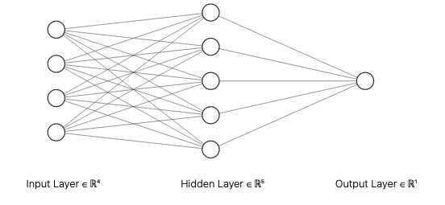
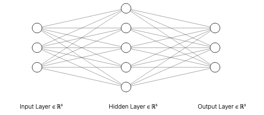
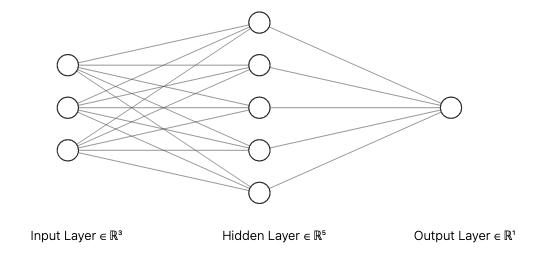
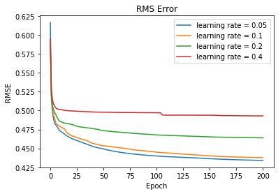
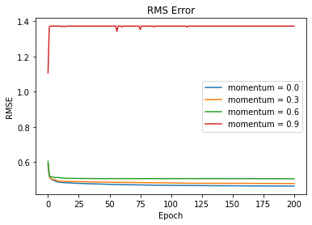
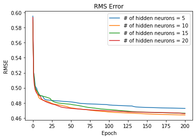
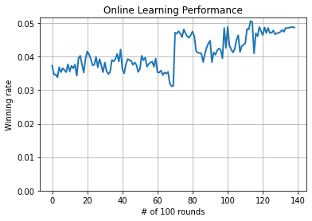
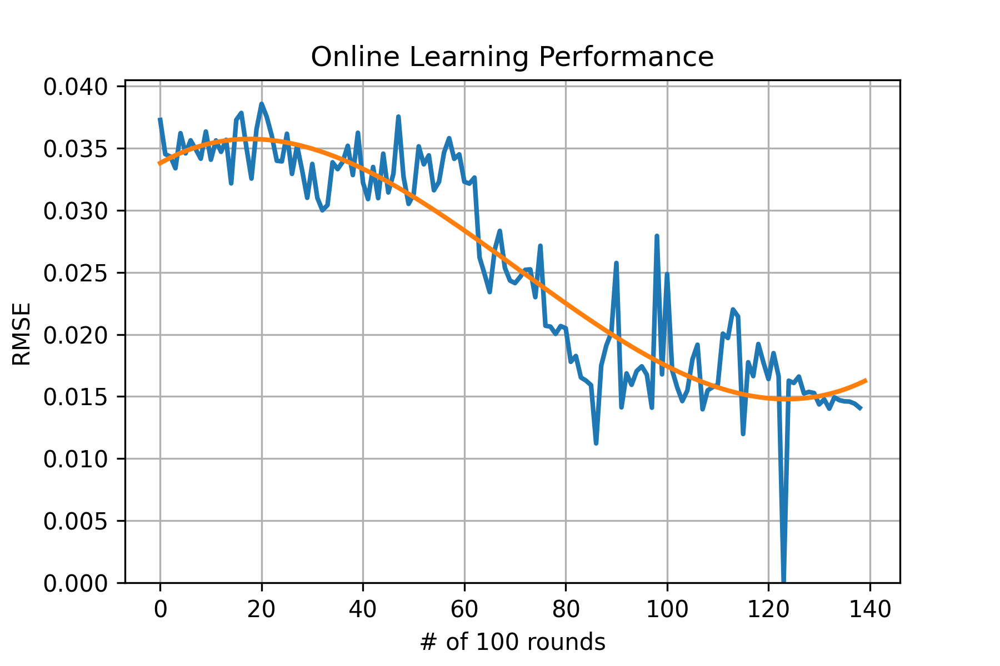
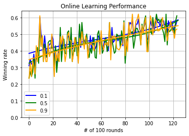

# CPEN502 Assignment 3

## Authors

Xuechun Qiu, 55766737

Tao Ma, 13432885

## Questions

### (4) _The use of a neural network to replace the look-up table and approximate the Q-function has some disadvantages and advantages._

#### a) _There are 3 options for the architecture of your neural network. Describe and draw all three options and state which you selected and why. (3pts)_



The first option is straightforward, which is given state-action pair as inputs, and then output a single Q value.



The second option is given states as inputs, using a neural network to compute the Q value of all the possible actions. In this way, we consider the neural network as an action selector which will choose the best action based on the state inputs.



The third option combines the previous two architectures, give neural networks as inputs, and output single Q value. If we have n actions, this model will use n neural networks to compute the Q value for each action.

Comparing these 3 architectures, there are pros and cons for all three options. Option 1 is an easier implementation, but combining the state and action together may result in issues which will reduce the model accuracy. The option 2 may converges differently for each action, which may lead to unexpected behaviours when combining several actions. The option 3 is a little complicated and time consuming, but it may be more accurate since we use one NN for one action. We implemented three architectures but we chose the second one to generate graphs using in the report.


#### b) _Show (as a graph) the results of training your neural network using the contents of the LUT from Part 2. Your answer should describe how you found the hyper-parameters which worked best for you (i.e. momentum, learning rate, number of hidden neurons). Provide graphs to backup your selection process. Compute the RMS error for your best results. (5 pts)_

##### Learning rate
Momentum = 0.0, Number of hidden neurons = 10

| Learning rates | 0.05  | 0.1   | 0.2   | 0.4   |
|----------------|-------|-------|-------|-------|
| RMS Error      | 0.446 | 0.450 | 0.471 | 0.497 |



As we can see from the figure, RMS error will be smaller when learning rate is smaller. The possible reason is that a large learning rate allows the model to learn faster, at the cost of arriving on a sub-optimal final set of weights. A smaller learning rate may allow the model to learn a more optimal or even globally optimal set of weights but may take significantly longer to train. So to balance the tradeoff, we will set learning rate to 0.1.

##### Momentum
Learning rate = 0.1, Number of hidden neurons = 10

| Momentum  | 0.0   | 0.3   | 0.6   | 0.9   |
|-----------|-------|-------|-------|-------|
| RMS Error | 0.471 | 0.484 | 0.507 | 1.370 |



As we can see from the figure, RMS error will be smaller when momentum is smaller. We can also find that as momentum increases, the initial convergence speed increases as well. The possible reason is that, momentum is a way of accelerating the training process by updating the model parameters in the direction of the previous update, rather than in the direction of the current gradient. So based on the figure here, we will choose 0.0 as our momentum.

##### Number of hidden neurons
Learning rate = 0.1, Momentum = 0.0

| Numbers of hidden neurons | 5     | 10    | 15    | 20    |
|---------------------------|-------|-------|-------|-------|
| RMS Error                 | 0.479 | 0.471 | 0.474 | 0.472 |



As we can see from the figure, RMS error reaches the smallest value when the number of hidden neurons is 10, so we will just go for it.


#### c) _Comment on why theoretically a neural network (or any other approach to Q-function approximation) would not necessarily need the same level of state space reduction as a look up table. (2 pts)_

In assignment 2, the look-up table which record all states and actions before space reduction, which is very space consuming. However, neural networks and other methods for approximating Q-functions can be more flexible and efficient than lookup tables because they can generalize from examples, rather than needing to have explicit entries for every possible state. This indicates that they can frequently achieve good performance with a significantly smaller collection of states, or even by using continuous states as opposed to discrete ones. Additionally, finding accurate approximations of the Q-function can be made simpler by learning useful representations of the state space using neural networks or any other function approximations. They may be able to function well even in state spaces that are big or complex because to this.


### (5) _Hopefully you were able to train your robot to find at least one movement pattern that results in defeat of your chosen enemy tank, most of the time._

#### a) _Identify two metrics and use them to measure the performance of your robot with online training. I.e. during battle. Describe how the results were obtained, particularly with regard to exploration? Your answer should provide graphs to support your results. (5 pts)_

Two metrics that could be used to measure the performance of a robot with online training are winning rates and RMS errors. Winning rates measure the percentage of battles won by the robot, while RMS errors measure the average difference between the predicted and actual values for a given dataset.

The robot would need to take part in several battles and monitor its performance to get these results. By dividing the total number of victories by the total number of battles, the robot could then determine its winning percentages. The robot would have to forecast the surroundings or its actions in order to calculate RMS errors, then compare these predictions to the actual results. The square root of the average of the squares representing the discrepancies between the expected and actual values is known as the RMS error.

Metric 1: Winning Rates




Metric 2: RMS Errors



Winning rates and RMS errors can be related to exploration in several ways. A robot that investigates more, for instance, might have a greater winning percentage since it has had the chance to learn more about its surroundings and develop useful techniques. A robot that investigates less, however, might have a smaller RMS error because it is more certain of its predictions and makes less errors as a result. In general, a key component of training a robot with online learning is striking the correct balance between exploration and exploitation.


#### b) _The discount factor can be used to modify influence of future reward. Measure the performance of your robot for different values of  and plot your results. Would you expect higher or lower values to be better and why? (3 pts)_

The discount factor is a parameter which determines the relative importance of future rewards. A discount factor of 0 means that future rewards are not considered at all, while a discount factor of 1 means that all future rewards are considered equally.



Higher values of the discount factor are often thought to be better since they give future rewards more weight. This can aid the robot in learning longer-term tactics that might not yield results right away but might do so in the long run. Lower values of the discount factor, on the other hand, might be preferable in some situations where rewards are very erratic or the environment is changing quickly since they can assist the robot react to the changing environment more quickly.

#### c) _Theory question: With a look-up table, the TD learning algorithm is proven to converge – i.e. will arrive at a stable set of Q-values for all visited states. This is not so when the Q-function is approximated. Explain this convergence in terms of the Bellman equation and also why when using approximation, convergence is no longer guaranteed. (3 pts)_

The Bellman equation has a singular solution for the Q-values of each state, demonstrating that the TD learning algorithm converges when employing a look-up table. This indicates that the algorithm will eventually reach the right Q-values for all visited states as it updates the Q-values based on the Bellman equation.

The Bellman equation is a formula that connects a state in a Markov decision process to the actions that can be taken to get to that state and the states that can be reached by doing so. It is defined as follows: 

```math
Q(s,a) = R(s,a) + γ * max(Q(s',a'))
```
where Q(s,a) is the Q-value for state s and action a, R(s,a) is the immediate reward for taking action a in state s, γ is the discount factor, and s' and a' are the next state and action, respectively.

There is only one Q-value that fulfils the Bellman equation for any given state s and action a since each state's Q-values have a unique solution. This is only accurate when a look-up table accurately represents the Q-function.

However, convergence is no longer assured when the Q-function is estimated using a function approximation like a neural network. This is due to the fact that when the Q-function is precisely represented by a look-up table, the Bellman equation only has one unique solution for the Q-values of each state. The Q-function is simply a rough approximation of the real Q-function when approximation is used. This implies that the TD learning algorithm could not always converge to the right Q-values.


#### d) _When using a neural network for supervised learning, performance of training is typically measured by computing a total error over the training set. When using the NN for online learning of the -function in robocode this is not possible since there is no a-priori training set to work with. Suggest how you might monitor learning performance of the neural net now. (3 pts)_

The possible approaches to monitor the learning performance of neural net may be winning rate, the count of bullet hit, and the learning progress over time.

The winning rate is an important factor when evaluating the performance. If the winning rate increases after some rounds, it will imply that the model performs better than previous. 

The count of bullet hit might also reflect the learning performance. Based on the rule, the robot which can hit more will be more likely to win the game. 

Tracking the learning progress over time may be another strategy for assessing the neural network's performance during learning. To achieve this, the neural network could be operated in real-time while its performance on a collection of held-out episodes was regularly recorded. Then, the performance may be charted over time to demonstrate how it advances as the neural network keeps picking up new skills.


#### e) _At each time step, the neural net in your robot performs a back propagation using a single training vector provided by the RL agent. Modify your code so that it keeps an array of the last say n training vectors and at each time step performs n back propagations. Using graphs compare the performance of your robot for different values of n. (4 pts)_


We chose n = 10 and n = 100 to draw the graph, we can see that n = 10 is not learning, while the winning rate increases gradually when n = 100. Using a larger amount of n will allow the neural network to learn more effectively from a larger amount of training data. 


### (6) _Overall Conclusions_

#### a) _This question is open-ended and offers you an opportunity to reflect on what you have learned overall through this project. For example, what insights are you able to offer with regard to the practical issues surrounding the application of RL & BP to your problem? E.g. What could you do to improve the performance of your robot? How would you suggest convergence problems be addressed? What advice would you give when applying RL with neural network based function approximation to other practical applications? (4 pts)_

I have gained knowledge on how to use reinforcement learning and neural networks , especially back propagation, to solve real-world problems throughout this project. More importantly, I had opportunities to examine and comprehend the fundamentals of these two methodologies as I worked on building the robot using both RL and NN.

- What could you do to improve the performance of your robot?

I advise utilising more sophisticated RL algorithms, like deep Q-learning, which are better able to handle big and complex state spaces, to boost the robot's performance. Additionally, I would advise employing more advanced function approximations like deep neural networks, which can develop more potent and adaptable Q-function representations.

- How would you suggest convergence problems be addressed?

I would suggest using regularization techniques, such as weight decay and dropout, to prevent the neural network from overfitting to the training data.

- What advice would you give when applying RL with neural network based function approximation to other practical applications?

I would experimenting with various function approximators, such as shallow neural networks and linear models, to recognise their advantages and disadvantages. The performance and resilience of the learnt policy can be enhanced by combining exploration and regularisation methods with adaptive learning rates and momentum.


#### b) _Theory question: Imagine a closed-loop control system for automatically delivering anesthetic to a patient under going surgery. You intend to train the controller using the approach used in this project. Discuss any concerns with this and identify one potential variation that could alleviate those concerns. (3 pts)_

The main concern is the ethical issue. It may not be safe to utilise reinforcement learning in this setting, which is one potential worry with employing the method from this project to train a closed-loop control system for autonomously giving anaesthesia to a patient having surgery. This is due to the fact that algorithms used in reinforcement learning are created to maximise a specific reward function, which could not be consistent with the objectives of an anaesthetic delivery system. The training algorithm's reward function, for instance, can put the patient's comfort ahead of other crucial considerations like the patient's vital signs or the dosage of the anaesthetic.

Another concern is that input values can be extremely complicated since you need to consider different factor such as blood pressure, age, allergies, etc. 

One potential variant to address this issue is to employ a hybrid strategy that combines reinforcement learning with other methods like model-based control. Another potential variation is that we can use model to give more information and assist doctors instead of making decisions.

## Appendix

### org.homework.neuralnet.EnsembleNeuralNet

```java
package org.homework.neuralnet;

import lombok.Getter;
import lombok.NoArgsConstructor;
import lombok.Setter;
import org.homework.neuralnet.matrix.Matrix;
import org.homework.robot.model.Action;
import org.homework.robot.model.ImmutableState;
import org.homework.robot.model.State;

import java.io.File;
import java.io.IOException;
import java.util.ArrayList;
import java.util.Arrays;
import java.util.List;
import java.util.Map;
import java.util.Random;

@NoArgsConstructor
@Getter
@Setter
public class EnsembleNeuralNet {
    private static final double ALPHA = 0.1;
    private static final double GAMMA = 0.5;
    private static final double RANDOM_RATE = 0.1;
    private static final boolean KEEP = false;
    private final List<Double> errorLog = new ArrayList<>();
    public NeuralNetArrayImpl[] neuralNetArrays;
    public int actionSize;
    private double qTrainSampleError = 0;

    public EnsembleNeuralNet(final int actionSize) {
        this.actionSize = actionSize;

        this.neuralNetArrays = new NeuralNetArrayImpl[actionSize];

        for (int i = 0; i < actionSize; i++) {
            this.neuralNetArrays[i] =
                    new NeuralNetArrayImpl(
                            Action.values()[i].name(), ImmutableState.builder().build());
        }
    }

    double[] forward(final State state) {
        final double[] res = new double[this.neuralNetArrays.length];
        for (int i = 0; i < res.length; i++) {
            res[i] = this.neuralNetArrays[i].forward(state).data[0][0];
        }
        return res;
    }

    void train(final Map<State, double[]> qTable) {
        final double[][][] trainX =
                new double[this.neuralNetArrays.length][qTable.size()]
                        [ImmutableState.builder().build().getIndexedStateValue().length];

        final double[][][] trainY = new double[this.neuralNetArrays.length][qTable.size()][1];

        int curCount = 0;

        for (final Map.Entry<State, double[]> entry : qTable.entrySet()) {
            for (int i = 0; i < this.neuralNetArrays.length; i++) {
                trainX[i][curCount] = entry.getKey().getTrainingData(KEEP);
                trainY[i][curCount] = new double[] {entry.getValue()[i]};
            }
            curCount++;
        }

        for (int i = 0; i < this.neuralNetArrays.length; i++) {
            this.neuralNetArrays[i].train(trainX[i], trainY[i]);
        }
    }

    void train(final Map<State, double[]> qTable, final int epoch, final double errorThreshold) {
        int elapsedEpoch = 0;
        double totalError = 0;
        double curEpochError;
        double rmsError;
        do {
            curEpochError = 0;
            for (final Map.Entry<State, double[]> entry : qTable.entrySet()) {
                for (int i = 0; i < this.neuralNetArrays.length; i++) {
                    curEpochError +=
                            this.neuralNetArrays[i].train(
                                    entry.getKey().getTrainingData(KEEP),
                                    new double[] {entry.getValue()[i]});
                }
            }

            rmsError = this.rmse(curEpochError, qTable.size());

            totalError += rmsError;

            if (elapsedEpoch % 50 == 0) this.errorLog.add(rmsError);

            curEpochError /= new Integer(qTable.size()).doubleValue();

            if (elapsedEpoch++ % 1000 == 0)
                System.out.printf(
                        "NN: Current Epoch: %d %n Current Error: %f%n Current RMSE: %f%n",
                        elapsedEpoch, curEpochError, rmsError);

        } while (elapsedEpoch++ < epoch && rmsError > errorThreshold);

        System.out.printf(
                "NN trained for %d epochs, reached error per eentry.getKey().getTrainingData(KEEP)poch = %.2f, best error: %.2f%n",
                elapsedEpoch, totalError / elapsedEpoch, rmsError);
    }

    public int chooseAction(final State currentState) {
        if (Math.random() < RANDOM_RATE) {
            return Action.values()[new Random().nextInt(Action.values().length)].ordinal();
        }

        double max = Double.NEGATIVE_INFINITY;
        Action action = Action.AHEAD;

        final double[] curQ = this.forward(currentState);

        for (int i = 0; i < Action.values().length; i++) {
            if (max < curQ[i]) {
                action = Action.values()[i];
                max = curQ[i];
            }
        }

        return action.ordinal();
    }

    public void qTrain(
            final double reward,
            final State prevState,
            final Action prevAction,
            final State curState) {

        final double[] prevQ = this.forward(prevState);
        final double curQ = Arrays.stream(this.forward(curState)).max().orElse(0);
        final double loss = ALPHA * (reward + GAMMA * curQ - prevQ[prevAction.ordinal()]);
        final double updatedQ = prevQ[prevAction.ordinal()] + loss;

        this.qTrainSampleError +=
                this.neuralNetArrays[prevAction.ordinal()]
                        .loss(
                                new Matrix(
                                        new double[][] {
                                            new double[] {prevQ[prevAction.ordinal()]}
                                        }),
                                new Matrix(new double[][] {new double[] {updatedQ}}),
                                0.5)
                        .sumValues();

        this.neuralNetArrays[prevAction.ordinal()].backpropagation(
                new Matrix(new double[][] {new double[] {prevQ[prevAction.ordinal()]}}),
                new Matrix(new double[][] {new double[] {updatedQ}}));
    }

    private double rmse(final double sampleError, final int sampleSize) {
        return Math.sqrt(sampleError / new Integer(sampleSize).doubleValue());
    }

    public void load(final File dataFile) throws IOException {}
}
```

### org.homework.neuralnet.NeuralNetArrayImpl
```java
package org.homework.neuralnet;

import lombok.Getter;
import lombok.NoArgsConstructor;
import lombok.Setter;
import org.homework.neuralnet.matrix.Matrix;
import org.homework.robot.model.Action;
import org.homework.robot.model.ImmutableState;
import org.homework.robot.model.State;

import java.io.File;
import java.io.IOException;
import java.util.ArrayList;
import java.util.Arrays;
import java.util.List;
import java.util.Map;
import java.util.Random;

@NoArgsConstructor
@Getter
@Setter
public class EnsembleNeuralNet {
    private static final double ALPHA = 0.1;
    private static final double GAMMA = 0.5;
    private static final double RANDOM_RATE = 0.1;
    private static final boolean KEEP = false;
    private final List<Double> errorLog = new ArrayList<>();
    public NeuralNetArrayImpl[] neuralNetArrays;
    public int actionSize;
    private double qTrainSampleError = 0;

    public EnsembleNeuralNet(final int actionSize) {
        this.actionSize = actionSize;

        this.neuralNetArrays = new NeuralNetArrayImpl[actionSize];

        for (int i = 0; i < actionSize; i++) {
            this.neuralNetArrays[i] =
                    new NeuralNetArrayImpl(
                            Action.values()[i].name(), ImmutableState.builder().build());
        }
    }

    double[] forward(final State state) {
        final double[] res = new double[this.neuralNetArrays.length];
        for (int i = 0; i < res.length; i++) {
            res[i] = this.neuralNetArrays[i].forward(state).data[0][0];
        }
        return res;
    }

    void train(final Map<State, double[]> qTable) {
        final double[][][] trainX =
                new double[this.neuralNetArrays.length][qTable.size()]
                        [ImmutableState.builder().build().getIndexedStateValue().length];

        final double[][][] trainY = new double[this.neuralNetArrays.length][qTable.size()][1];

        int curCount = 0;

        for (final Map.Entry<State, double[]> entry : qTable.entrySet()) {
            for (int i = 0; i < this.neuralNetArrays.length; i++) {
                trainX[i][curCount] = entry.getKey().getTrainingData(KEEP);
                trainY[i][curCount] = new double[] {entry.getValue()[i]};
            }
            curCount++;
        }

        for (int i = 0; i < this.neuralNetArrays.length; i++) {
            this.neuralNetArrays[i].train(trainX[i], trainY[i]);
        }
    }

    void train(final Map<State, double[]> qTable, final int epoch, final double errorThreshold) {
        int elapsedEpoch = 0;
        double totalError = 0;
        double curEpochError;
        double rmsError;
        do {
            curEpochError = 0;
            for (final Map.Entry<State, double[]> entry : qTable.entrySet()) {
                for (int i = 0; i < this.neuralNetArrays.length; i++) {
                    curEpochError +=
                            this.neuralNetArrays[i].train(
                                    entry.getKey().getTrainingData(KEEP),
                                    new double[] {entry.getValue()[i]});
                }
            }

            rmsError = this.rmse(curEpochError, qTable.size());

            totalError += rmsError;

            if (elapsedEpoch % 50 == 0) this.errorLog.add(rmsError);

            curEpochError /= new Integer(qTable.size()).doubleValue();

            if (elapsedEpoch++ % 1000 == 0)
                System.out.printf(
                        "NN: Current Epoch: %d %n Current Error: %f%n Current RMSE: %f%n",
                        elapsedEpoch, curEpochError, rmsError);

        } while (elapsedEpoch++ < epoch && rmsError > errorThreshold);

        System.out.printf(
                "NN trained for %d epochs, reached error per eentry.getKey().getTrainingData(KEEP)poch = %.2f, best error: %.2f%n",
                elapsedEpoch, totalError / elapsedEpoch, rmsError);
    }

    public int chooseAction(final State currentState) {
        if (Math.random() < RANDOM_RATE) {
            return Action.values()[new Random().nextInt(Action.values().length)].ordinal();
        }

        double max = Double.NEGATIVE_INFINITY;
        Action action = Action.AHEAD;

        final double[] curQ = this.forward(currentState);

        for (int i = 0; i < Action.values().length; i++) {
            if (max < curQ[i]) {
                action = Action.values()[i];
                max = curQ[i];
            }
        }

        return action.ordinal();
    }

    public void qTrain(
            final double reward,
            final State prevState,
            final Action prevAction,
            final State curState) {

        final double[] prevQ = this.forward(prevState);
        final double curQ = Arrays.stream(this.forward(curState)).max().orElse(0);
        final double loss = ALPHA * (reward + GAMMA * curQ - prevQ[prevAction.ordinal()]);
        final double updatedQ = prevQ[prevAction.ordinal()] + loss;

        this.qTrainSampleError +=
                this.neuralNetArrays[prevAction.ordinal()]
                        .loss(
                                new Matrix(
                                        new double[][] {
                                            new double[] {prevQ[prevAction.ordinal()]}
                                        }),
                                new Matrix(new double[][] {new double[] {updatedQ}}),
                                0.5)
                        .sumValues();

        this.neuralNetArrays[prevAction.ordinal()].backpropagation(
                new Matrix(new double[][] {new double[] {prevQ[prevAction.ordinal()]}}),
                new Matrix(new double[][] {new double[] {updatedQ}}));
    }

    private double rmse(final double sampleError, final int sampleSize) {
        return Math.sqrt(sampleError / new Integer(sampleSize).doubleValue());
    }

    public void load(final File dataFile) throws IOException {}
}
```
### org.homework.neuralnet.matrix.Matrix

```java
package org.homework.neuralnet.matrix;

import lombok.AllArgsConstructor;
import lombok.Getter;
import lombok.NoArgsConstructor;
import lombok.Setter;
import org.homework.neuralnet.matrix.op.ElementTransformation;
import org.homework.util.Util;

import java.util.Arrays;

@AllArgsConstructor
@NoArgsConstructor
@Getter
@Setter
public class Matrix {
    public int rowNum;
    public int colNum;
    public double[][] data;

    public Matrix(final double[][] _data) {
        this.rowNum = _data.length;
        this.colNum = _data[0].length;
        this.data = _data;
    }

    public Matrix(final int r, final int c) {
        this(new double[r][c]);
    }

    public static Matrix initZeroMatrix(final int r, final int c) {
        return new Matrix(r, c, new double[r][c]);
    }

    public static Matrix initRandMatrix(final int r, final int c) {
        return new Matrix(r, c).elementWiseOp(0, (a, b) -> Math.random());
    }

    /**
     * return a matrix which is the result of this matrix dot products with other matrix
     *
     * @param matrix matrix on the rhs
     * @return a matrix which is the result of this matrix dot products with other matrix
     */
    public Matrix mmul(final Matrix matrix) {
        final double[][] newData = new double[this.data.length][matrix.data[0].length];
        for (int i = 0; i < newData.length; i++) {
            for (int j = 0; j < newData[i].length; j++) {
                newData[i][j] = this.multiplyMatricesCell(this.data, matrix.data, i, j);
            }
        }
        return new Matrix(newData);
    }

    private double multiplyMatricesCell(
            final double[][] firstMatrix,
            final double[][] secondMatrix,
            final int row,
            final int col) {
        double cell = 0;
        for (int i = 0; i < secondMatrix.length; i++) {
            cell += firstMatrix[row][i] * secondMatrix[i][col];
        }
        return cell;
    }

    public Matrix transpose() {
        final double[][] temp = new double[this.data[0].length][this.data.length];
        for (int i = 0; i < this.rowNum; i++)
            for (int j = 0; j < this.colNum; j++) temp[j][i] = this.data[i][j];
        return new Matrix(temp);
    }

    public Matrix mul(final double x) {
        return this.elementWiseOp(x, (a, b) -> a * b);
    }

    public Matrix mul(final Matrix matrix) {
        return this.elementWiseOp(matrix, (a, b) -> a * b);
    }

    public Matrix add(final double x) {
        return this.elementWiseOp(x, Double::sum);
    }

    public Matrix add(final Matrix matrix) {
        return this.elementWiseOp(matrix, Double::sum);
    }

    public Matrix sub(final double x) {
        return this.elementWiseOp(x, (a, b) -> a - b);
    }

    public Matrix sub(final Matrix matrix) {
        return this.elementWiseOp(matrix, (a, b) -> a - b);
    }

    public Matrix elementWiseOp(
            final double operand, final ElementTransformation elementTransformation) {
        final double[][] dataClone = Util.getDeepArrayCopy(this.data);
        for (int i = 0; i < dataClone.length; i++) {
            for (int j = 0; j < dataClone[0].length; j++) {
                dataClone[i][j] = elementTransformation.op(dataClone[i][j], operand);
            }
        }
        return new Matrix(dataClone);
    }

    public Matrix elementWiseOp(
            final Matrix matrix, final ElementTransformation elementTransformation) {
        final double[][] dataClone = Util.getDeepArrayCopy(this.data);
        for (int i = 0; i < dataClone.length; i++) {
            for (int j = 0; j < dataClone[0].length; j++) {
                dataClone[i][j] = elementTransformation.op(dataClone[i][j], matrix.data[i][j]);
            }
        }
        return new Matrix(dataClone);
    }

    public double sumValues() {
        return Arrays.stream(this.data).flatMapToDouble(Arrays::stream).sum();
    }

    @Override
    public boolean equals(final Object obj) {
        if (obj == this) return true;

        if (!(obj instanceof Matrix)) return false;

        final Matrix matrix = (Matrix) obj;

        return Arrays.deepEquals(this.data, matrix.data);
    }

    @Override
    public int hashCode() {
        return Arrays.deepHashCode(this.data);
    }
}
```
### org.homework.neuralnet.matrix.op.ElementTransformation
```java
package org.homework.neuralnet.matrix.op;

public interface ElementTransformation {
    double op(double x, double y);
}
```
### org.homework.robot.model.Memory
```java
package org.homework.robot.model;

import org.immutables.value.Value;

@Value.Immutable
public abstract class Memory {
    @Value.Default
    public State getPrevState() {
        return ImmutableState.builder().build();
    }

    @Value.Default
    public State getCurState() {
        return ImmutableState.builder().build();
    }

    @Value.Default
    public double getReward() {
        return 1.0;
    }

    @Value.Default
    public Action getPrevAction() {
        return Action.values()[0];
    }

    @Override
    public String toString() {
        return String.format("Prev: %s %n Current: %s %n", this.getPrevState(), this.getCurState());
    }
}
```
### org.homework.robot.model.State
```java
package org.homework.robot.model;

import org.homework.util.Util;
import org.immutables.value.Value;

import java.util.Arrays;

@Value.Immutable
public abstract class State {
    @Value.Default
    public StateName.HP getCurrentHP() {
        return StateName.HP.MID;
    }

    @Value.Default
    public StateName.ENEMY_HP getCurrentEnemyHP() {
        return StateName.ENEMY_HP.MID;
    }

    @Value.Default
    public StateName.DISTANCE_TO_ENEMY getCurrentDistanceToEnemy() {
        return StateName.DISTANCE_TO_ENEMY.MID;
    }

    @Value.Default
    public StateName.DISTANCE_TO_WALL getCurrentDistanceToWall() {
        return StateName.DISTANCE_TO_WALL.MID;
    }

    @Value.Default
    public StateName.ENEMY_ROBOT_HEADING getCurrentEnemyRobotHeading() {
        return StateName.ENEMY_ROBOT_HEADING.MID;
    }

    @Value.Default
    public StateName.X getX() {
        return StateName.X.MID;
    }

    @Value.Default
    public StateName.Y getY() {
        return StateName.Y.MID;
    }

    @Value.Default
    public double[] getDequantizedState() {
        return new double[7];
    }

    @Value.Default
    public double[] getTrainingData(final boolean keep) {
        return keep
                ? Util.getDoubleArrayFromIntArray(this.getIndexedStateValue())
                : this.getDequantizedState();
    }

    @Value.Default
    public int[] getIndexedStateValue() {
        return new int[] {
            this.getCurrentHP().ordinal(),
            this.getCurrentEnemyHP().ordinal(),
            this.getCurrentDistanceToEnemy().ordinal(),
            this.getCurrentDistanceToWall().ordinal(),
            this.getCurrentEnemyRobotHeading().ordinal(),
            this.getX().ordinal(),
            this.getY().ordinal()
        };
    }

    @Override
    public String toString() {
        return String.format(
                "Current State Array: %s", Arrays.toString(this.getIndexedStateValue()));
    }

    @Override
    public boolean equals(final Object obj) {
        if (obj == this) return true;

        if (!(obj instanceof State)) return false;

        final State state = (State) obj;

        return Arrays.equals(this.getDequantizedState(), state.getDequantizedState());
    }

    @Override
    public int hashCode() {
        return Arrays.hashCode(this.getDequantizedState());
    }
}
```
### org.homework.robot.NNRobot
```java
/*
 * Copyright (c) 2001-2022 Mathew A. Nelson and Robocode contributors
 * All rights reserved. This program and the accompanying materials
 * are made available under the terms of the Eclipse Public License v1.0
 * which accompanies this distribution, and is available at
 * https://robocode.sourceforge.io/license/epl-v10.html
 */
package org.homework.robot;

import org.homework.neuralnet.NeuralNetArrayImpl;
import org.homework.replaymemory.ReplayMemory;
import org.homework.robot.model.Action;
import org.homework.robot.model.ImmutableMemory;
import org.homework.robot.model.ImmutableState;
import org.homework.robot.model.Memory;
import org.homework.robot.model.State;
import robocode.BattleEndedEvent;
import robocode.RoundEndedEvent;
import robocode.ScannedRobotEvent;

import java.io.IOException;
import java.util.ArrayList;
import java.util.List;

/**
 * Corners - a sample robot by Mathew Nelson.
 *
 * <p>This robot moves to a corner, then swings the gun back and forth. If it dies, it tries a new
 * corner in the next round.
 *
 * @author Mathew A. Nelson (original)
 * @author Flemming N. Larsen (contributor)
 */
public class NNRobot extends AIRobot {
    private static final NeuralNetArrayImpl neuralNetArray =
            new NeuralNetArrayImpl(
                    "Default Neural Net",
                    ImmutableState.builder().build(),
                    25,
                    Action.values().length,
                    0.1,
                    0.0,
                    true);
    private static final int MINI_BATCH_SIZE = 20;
    private static final int MEMORY_SIZE = 200;
    private static final String PREV_TRAINED_WEIGHT = "weights.txt";
    private static final ReplayMemory<Memory> replayMemory = new ReplayMemory<>(MEMORY_SIZE);
    private static final List<Double> qTrainRMSE = new ArrayList<>();

    @Override
    public void run() {
        this.setAdjustGunForRobotTurn(true);
        this.setAdjustRadarForGunTurn(true);
        this.load();
        while (true) {
            this.setTurnRadarLeftRadians(2 * Math.PI);
            this.scan();
            this.setCurrentAction(this.chooseCurrentAction());
            this.act();
            this.updateQValue();
            this.setReward(.0);
        }
    }

    @Override
    public Action chooseCurrentAction() {
        return Action.values()[neuralNetArray.chooseAction(currentState)];
    }

    @Override
    /** Update q value */
    public void updateQValue() {
        final Memory memory =
                ImmutableMemory.builder()
                        .curState(currentState)
                        .prevState(prevState)
                        .reward(this.getReward())
                        .prevAction(this.getCurrentAction())
                        .build();
        replayMemory.add(memory);
        if (replayMemory.sizeOf() >= MINI_BATCH_SIZE) {
            neuralNetArray.setQTrainSampleError(0);
            int curTrainSize = 0;
            for (final Object object : replayMemory.randomSample(MINI_BATCH_SIZE)) {
                final Memory experienceBatch = (Memory) object;
                neuralNetArray.qTrain(
                        experienceBatch.getReward(),
                        experienceBatch.getPrevState(),
                        experienceBatch.getPrevAction(),
                        experienceBatch.getCurState());
                curTrainSize++;
            }
            qTrainRMSE.add(
                    neuralNetArray.rmse(neuralNetArray.getQTrainSampleError(), curTrainSize));
        }
    }

    @Override
    public void onRoundEnded(final RoundEndedEvent event) {
        totalRound++;
        this.logWinStatue(100);
        if (totalRound % 100 == 0) {
            log.writeRMSEToFile(this.getDataFile("rmse.log"), qTrainRMSE, 100, true);
            qTrainRMSE.clear();
        }
    }

    /**
     * Get current scanned state
     *
     * @param event The event of scan
     * @return State represent current
     */
    @Override
    public State findCurrentState(final ScannedRobotEvent event) {
        this.setBearing(event.getBearing());
        return ImmutableState.builder()
                .dequantizedState(
                        this.getEnergy() / 100.0,
                        event.getEnergy() / 100.0,
                        event.getDistance() / 1000.0,
                        this.getDistanceFromWall(this.getX(), this.getY()) / 1000.0,
                        event.getBearing() / 360.0,
                        this.getX() / 800.0,
                        this.getY() / 600.0)
                .build();
    }

    @Override
    public void load() {
        try {
            neuralNetArray.load(this.getDataFile(PREV_TRAINED_WEIGHT));
            System.out.println("Loaded");
        } catch (final IOException e) {
            throw new RuntimeException(e);
        }
    }

    @Override
    public void onBattleEnded(final BattleEndedEvent event) {
        neuralNetArray.save(this.getDataFile((PREV_TRAINED_WEIGHT)), true);
    }
}
```
### org.homework.neuralnet.EnsembleNeuralNetTest
```java
package org.homework.neuralnet;

import org.homework.rl.LUTImpl;
import org.homework.robot.model.Action;
import org.homework.robot.model.ImmutableState;
import org.junit.jupiter.api.BeforeEach;
import org.junit.jupiter.api.Test;

import java.io.IOException;

class EnsembleNeuralNetTest {

    @BeforeEach
    void setUp() {}

    @Test
    void QTRAIN_WORK() {
        final EnsembleNeuralNet mockEnsembleNeuralNet =
                new EnsembleNeuralNet(Action.values().length);

        mockEnsembleNeuralNet.qTrain(
                0.1,
                ImmutableState.builder().build(),
                Action.AHEAD,
                ImmutableState.builder().build());
    }

    @Test
    void ONE_NN_FOR_EACH_ACTION() throws IOException {
        // lut q table gained from AI robot
        final String offlineTrainingDate = "robot-log/AIRobot-crazy-robot.txt";
        final LUTImpl lut = new LUTImpl(ImmutableState.builder().build());
        lut.load(offlineTrainingDate);

        final EnsembleNeuralNet ensembleNeuralNet = new EnsembleNeuralNet(Action.values().length);

        ensembleNeuralNet.train(lut.qTable);

        for (int i = 0; i < ensembleNeuralNet.neuralNetArrays.length; i++) {
            System.out.printf(
                    "%s error log: %s%n",
                    Action.values()[i].name(), ensembleNeuralNet.neuralNetArrays[i].getErrorLog());
        }
    }

    @Test
    void ONE_NN_FOR_EACH_ACTION_AGGREGATE_TRAIN() throws IOException {
        // lut q table gained from AI robot
        final String offlineTrainingDate = "robot-log/AIRobot-crazy-robot.txt";
        final LUTImpl lut = new LUTImpl(ImmutableState.builder().build());
        lut.load(offlineTrainingDate);

        final EnsembleNeuralNet ensembleNeuralNet = new EnsembleNeuralNet(Action.values().length);

        ensembleNeuralNet.train(lut.qTable, 10000, 0.01);

        System.out.println(ensembleNeuralNet.getErrorLog());
    }
}
```
### org.homework.neuralnet.NeuralNetArrayImplTest
```java
package org.homework.neuralnet;

import org.homework.rl.LUTImpl;
import org.homework.robot.model.Action;
import org.homework.robot.model.ImmutableState;
import org.homework.robot.model.State;
import org.junit.jupiter.api.BeforeEach;
import org.junit.jupiter.api.Test;

import java.io.IOException;
import java.util.Map;

import static org.homework.TestUtil.getRandomInputVector;
import static org.homework.TestUtil.printNNTrainState;
import static org.junit.jupiter.api.Assertions.assertEquals;

class NeuralNetArrayImplTest {

    NeuralNetArrayImpl neuralNetArray;

    int testArgNumInputs = 2;

    int testArgNumHidden = 4;

    int testArgNumOutputs = 1;

    @BeforeEach
    void setUp() {
        this.neuralNetArray =
                new NeuralNetArrayImpl(
                        this.testArgNumInputs,
                        this.testArgNumHidden,
                        this.testArgNumOutputs,
                        .1,
                        .0,
                        1,
                        0,
                        false);
    }

    @Test
    void TEST_TRAIN_XOR_RANDOM() {
        final double[][] x = getRandomInputVector(10, this.testArgNumInputs);
        final double[][] yHat = getRandomInputVector(10, this.testArgNumOutputs);
        this.neuralNetArray.train(x, yHat);
        printNNTrainState(x, yHat, this.neuralNetArray.batchForward(x).getData());
    }

    @Test
    void TEST_TRAIN_XOR_THEN_APPLY() {
        final double[][] x = new double[][] {{0, 0}, {0, 1}, {1, 0}, {1, 1}};
        final double[][] yHat = new double[][] {{0}, {1}, {1}, {0}};
        this.neuralNetArray.train(x, yHat);
        printNNTrainState(x, yHat, this.neuralNetArray.batchForward(x).getData());
    }

    @Test
    void TEST_TRAIN_XOR_BIPOLAR() {
        this.neuralNetArray.setBipolar(true);
        final double[][] x = new double[][] {{-1, -1}, {-1, 1}, {1, -1}, {1, 1}};
        final double[][] yHat = new double[][] {{-1}, {1}, {1}, {-1}};
        this.neuralNetArray.train(x, yHat);
        printNNTrainState(x, yHat, this.neuralNetArray.batchForward(x).getData());
    }

    @Test
    void TEST_NN_FOR_DIFFERENT_DIMENSION() {
        final State mockState = ImmutableState.builder().build();
        this.neuralNetArray = new NeuralNetArrayImpl("mockNN", mockState);
        assertEquals(
                Action.values().length,
                this.neuralNetArray
                        .forward(new double[1][mockState.getIndexedStateValue().length])
                        .getColNum());
    }

    @Test
    void OFFLINE_TRAINING_PROCESS() throws IOException {
        final NeuralNetArrayImpl nn =
                new NeuralNetArrayImpl("NN", ImmutableState.builder().build(), 10, 0.3, 0.1, true);

        // lut q table gained from AI robot
        final String offlineTrainingDate = "robot-log/AIRobot-crazy-robot.txt";
        final LUTImpl lut = new LUTImpl(ImmutableState.builder().build());
        lut.load(offlineTrainingDate);

        final double[][] trainX =
                new double[lut.qTable.size()]
                        [ImmutableState.builder().build().getIndexedStateValue().length];

        final double[][] trainY = new double[lut.qTable.size()][Action.values().length];

        int count = 0;

        for (final Map.Entry<State, double[]> entry : lut.qTable.entrySet()) {
            trainX[count] = entry.getKey().getTrainingData(true);
            trainY[count++] = entry.getValue();
        }

        nn.train(trainX, trainY);

        final String nnWeightFile = "./Weights";

        nn.save(nnWeightFile);

        final NeuralNetArrayImpl nnTestLoad =
                new NeuralNetArrayImpl(
                        "NNTest", ImmutableState.builder().build(), 10, 0.3, 0.1, true);

        nnTestLoad.load(nnWeightFile);

        assertEquals(nn.getInputToHiddenWeight(), nnTestLoad.getInputToHiddenWeight());
        assertEquals(nn.getHiddenToOutputWeight(), nnTestLoad.getHiddenToOutputWeight());
        assertEquals(nn.getHiddenLayerBias(), nnTestLoad.getHiddenLayerBias());
        assertEquals(nn.getOutputLayerBias(), nnTestLoad.getOutputLayerBias());
    }
}
```